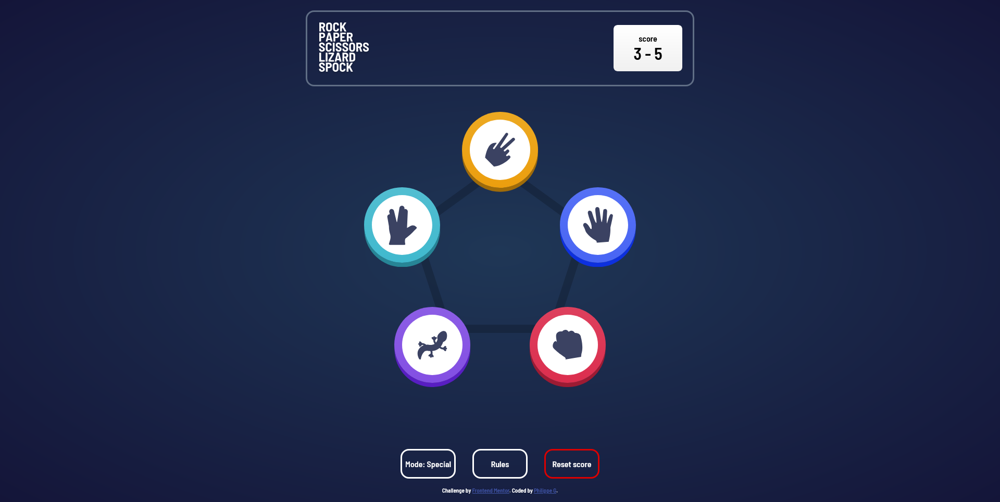
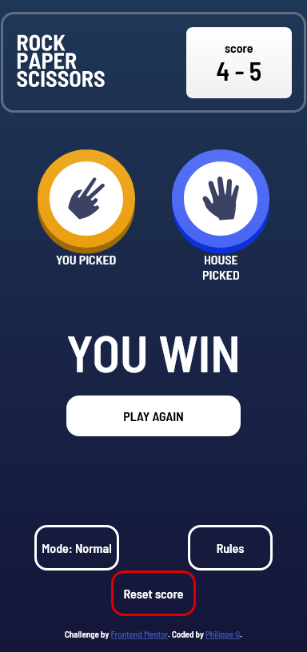

# Frontend Mentor - Rock, Paper, Scissors solution

This is a solution to the [Rock, Paper, Scissors challenge on Frontend Mentor](https://www.frontendmentor.io/challenges/rock-paper-scissors-game-pTgwgvgH). Frontend Mentor challenges help you improve your coding skills by building realistic projects.

## Table of contents

- [Frontend Mentor - Rock, Paper, Scissors solution](#frontend-mentor---rock-paper-scissors-solution)
  - [Table of contents](#table-of-contents)
  - [Overview](#overview)
    - [The challenge](#the-challenge)
    - [Screenshot](#screenshot)
    - [Links](#links)
  - [My process](#my-process)
    - [Built with](#built-with)
    - [What I learned](#what-i-learned)
    - [Continued development](#continued-development)
  - [Author](#author)

**Note: Delete this note and update the table of contents based on what sections you keep.**

## Overview

### The challenge

Users should be able to:

- View the optimal layout for the game depending on their device's screen size
- Play Rock, Paper, Scissors against the computer
- Maintain the state of the score after refreshing the browser _(optional)_
- **Bonus**: Play Rock, Paper, Scissors, Lizard, Spock against the computer _(optional)_

### Screenshot





### Links

- Solution URL: [Add solution URL here](https://www.frontendmentor.io/solutions/classic-rps-and-rpsls-bonus-mode-with-permanent-storage-8kIzGIjw4u)
- Live Site URL: [Github pages](https://z0ul0u25.github.io/FeM-RockPaperScissors/)

## My process

### Built with

- Semantic HTML5 markup
- CSS absolute and relative position
- CSS flexbox
- Mobile-first workflow


### What I learned

Instead of doing a monster `if` statement to check if the player win or lose, I used a 2D array to represent every situation
```js
const RULE_SET = [
	[0, -1, 1, 1, -1],
	[1, 0, -1, -1, 1],
	[-1, 1, 0, 1, -1],
	[-1, 1, -1, 0, 1],
	[1, -1, 1, -1, 0]
];

const RESULT_FEEDBACK = {
	"-1":"YOU LOSE",
	"0":"TIE",
	"1":"YOU WIN"
};

// usage
let result = RULE_SET[playerChoice][cpuChoice];
```
This way, it's super easy to know if the player won or lost the battle.

### Continued development

The area I would like to focus more is CSS animation. My project here have a minimum amount but it sure would help to make the game feel more alive.

## Author

- Github - [Z0ul0u25](https://github.com/Z0ul0u25)
- Frontend Mentor - [@yourusername](https://www.frontendmentor.io/profile/Z0ul0u25)
